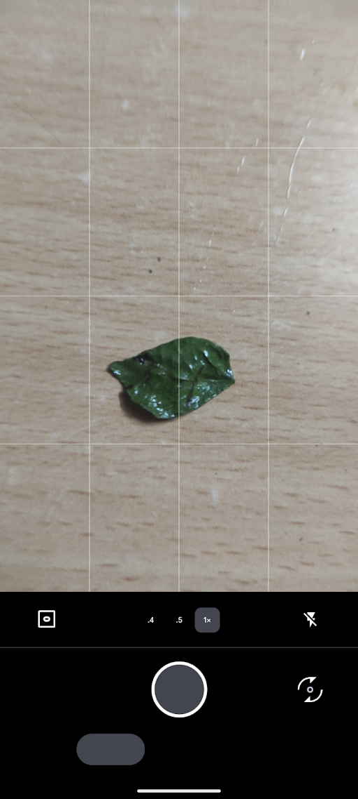
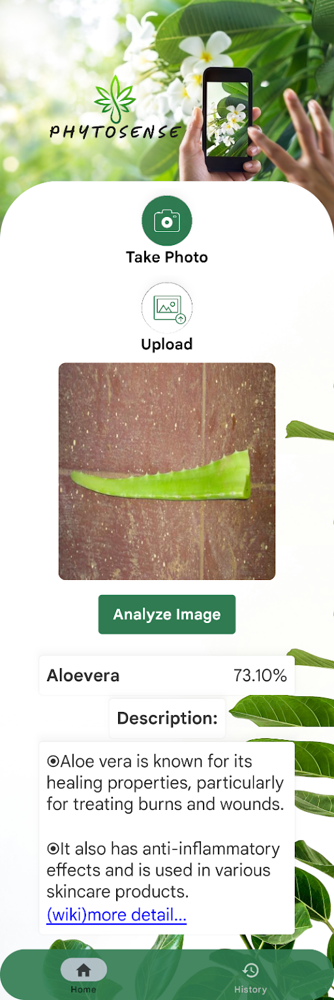
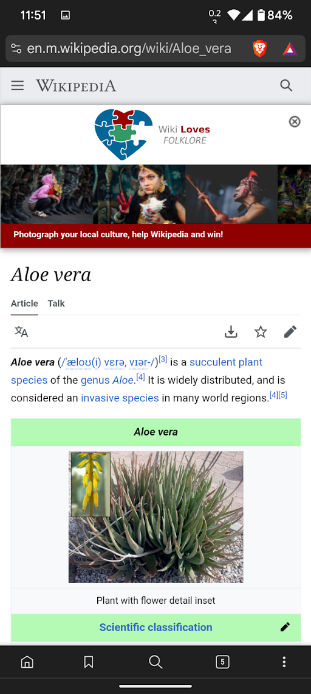
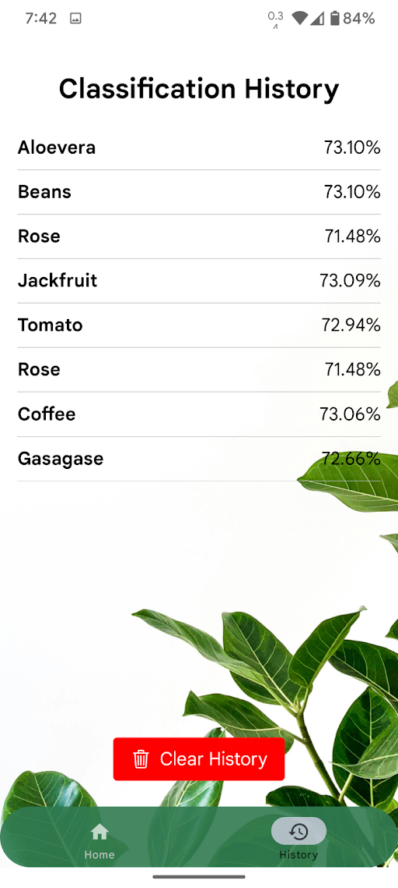

# Medicinal-Leaf-Classification--Android-ReactNative

# DataSet (kaggle)
>
>[Dataset](https://www.kaggle.com/datasets/aryashah2k/indian-medicinal-leaves-dataset)

# Quick Start:
> install npm
> 
> install expo
> 
> install node js

# Output Screen Shots:

>
>
>
>
>
>
>
>
>
>
>
>
>
>
>
